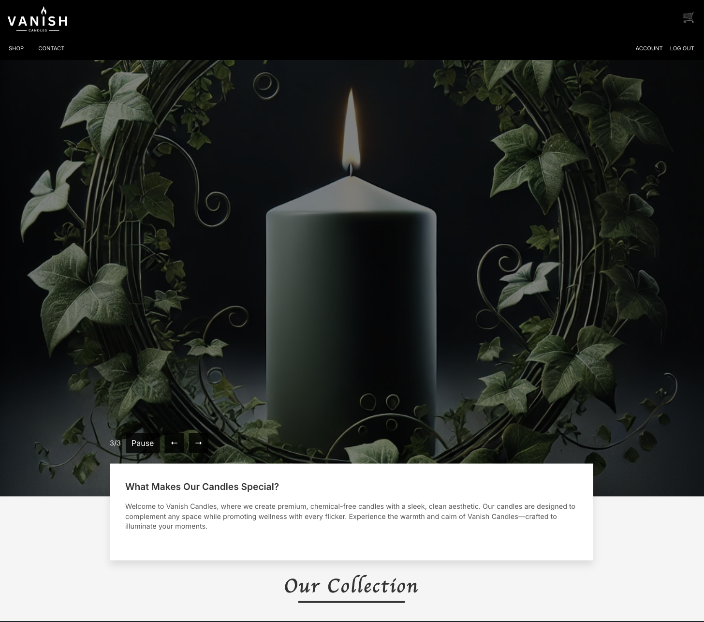

# 🔧 Vanish Candles

**Vanish Candles** is a luxurious, modern e-commerce frontend built with React — designed to elegantly showcase and sell high-end candles. With smooth animations, secure Stripe checkout, and a custom admin dashboard, this project blends beautiful design with real-world functionality.

---

  

---

## 🧱 Tech Stack

- **React 18** — Component-based SPA
- **React Router DOM** — Client-side routing
- **Styled Components** — Scoped styling with dynamic theming
- **Stripe** — Secure, production-ready checkout flow
- **React Hook Form + Yup** — Robust form validation
- **Framer Motion** — Subtle, smooth animations
- **Axios** — API integration
- **Custom Admin Dashboard** — For product and order management
- **Session Handling** — Authenticated routes and basic session logic

---

## 🛒 Key Features

- 🔐 **Authentication** — Register, sign in, session handling
- 🔧 **Product Browsing** — Clean, mobile-first UI to explore products
- 🛍️ **Shopping Cart** — Add/remove items and quantity control
- 💳 **Stripe Checkout** — Secure payments
- 📬 **Email Confirmation** _(integration in progress)_
- 🧑‍💼 **Admin Panel** — Manage inventory and view orders _(role-based)_
- 🔄 **Fallback UX** — Gracefully handles offline/backend-down scenarios
- 📱 **Fully Responsive** — Works great on mobile devices

---

## 🎯 Why This Project?

This app simulates a real-world e-commerce flow — but polished with design sensibility. It's more than just a CRUD project: it reflects UX thinking, component reuse, defensive coding, and clear separation of concerns. Built to impress _and_ scale.

---

## 📬 Contact

Have a project in mind or want to chat about frontend roles?  
**Let’s connect!** Reach out at `andrewgomez.dev@gmail.com` or drop me a message on [LinkedIn](https://linkedin.com/in/your-profile).

---

Made with intention, creativity, and a few late-night candles ✨  
**— Andrew Gomez**
